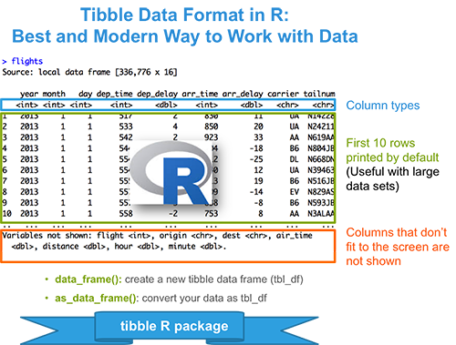

### 理想的處理格式：`tbl_df`


- The traditional R base functions `read.table()`, `read.delim()` and `read.csv()` import data into R as a data frame. However, the most modern R package `readr` provides several functions (`read_delim()`, `read_tsv()` and `read_csv()`), which are faster than R base functions and import data into R as a tbl_df (pronounced as “tibble diff”).


- The `tibble` R package (又是 Hadley Wickham) provides easy to use functions for creating tibbles, which is a modern rethinking of data frames.


- 比起傳統的 `data.frame()`

 - never converts string as factor

 - never changes the names of variables

 - never create row names





### 安裝與載入

```

install.packages("tibble")

library(tibble)

```


> Note that, if you use the `readr` package to import your data into R, then you don’t need to do this step. readr imports already data as **tbl_df**.


#### Convert your data as a tibble

```

data(iris)

class(iris)

head(iris, 6)

# Convert iris data to a tibble

my_data <- as_data_frame(iris)

class(my_data)

my_data

```


### 何謂 tidy data


A data set is called tidy when:


- each column represents a variable

- and each row represents an observation

- The opposite of tidy is messy data, which corresponds to any other arrangement of the data.


#### 為何需要 tidying the data?

Having your data in tidy format is crucial for facilitating the tasks of data analysis including data manipulation, modeling and visualization.


